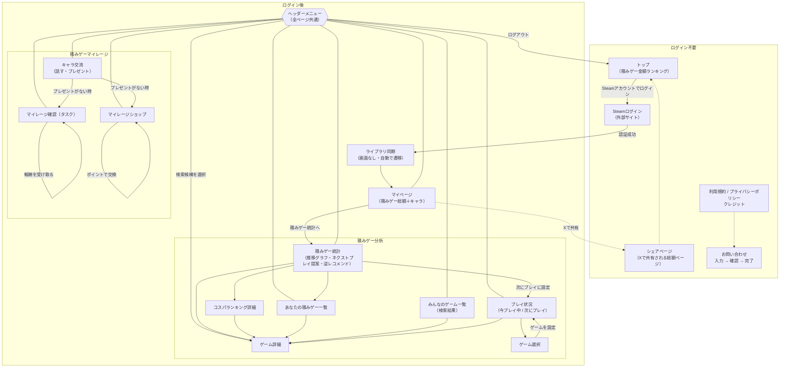

```mermaid
flowchart TD
  subgraph guest["ログイン不要"]
    top["トップ<br/>（積みゲー金額ランキング）"]
    steam["Steamログイン<br/>（外部サイト）"]
    share["シェアページ<br/>（Xで共有される総額ページ）"]
    static["利用規約 / プライバシーポリシー<br/>クレジット"]
    contact["お問い合わせ<br/>入力 → 確認 → 完了"]
  end

  subgraph member["ログイン後"]
    loading["ライブラリ同期<br/>（画面なし・自動で遷移）"]
    mypage["マイページ<br/>（積みゲー総額＋キャラ）"]
    header{{"ヘッダーメニュー<br/>（全ページ共通）"}}

    subgraph analysis["積みゲー分析"]
      statistic["積みゲー統計<br/>（推移グラフ・ネクストプレイ提案・逆レコメンド）"]
      ranking["コスパランキング詳細"]
      backlog["あなたの積みゲー一覧"]
      games["みんなのゲーム一覧<br/>（検索結果）"]
      game["ゲーム詳細"]
      focus["プレイ状況<br/>（今プレイ中 / 次にプレイ）"]
      picker["ゲーム選択"]
    end

    subgraph mileage["積みゲーマイレージ"]
      tasks["マイレージ確認（タスク）"]
      shop["マイレージショップ"]
      character["キャラ交流<br/>（話す・プレゼント）"]
    end
  end

  top -->|Steamアカウントでログイン| steam
  steam -->|認証成功| loading
  loading --> mypage
  mypage -->|積みゲー統計へ| statistic
  mypage -.->|Xで共有| share
  share -.-> top

  header --- mypage
  header --- statistic
  header --- backlog
  header --- games
  header --- focus
  header --- tasks
  header --- shop
  header --- character
  header -->|検索候補を選択| game
  header -->|ログアウト| top

  statistic --> ranking
  statistic --> backlog
  statistic -->|次にプレイに設定| focus
  statistic --> game
  ranking --> game
  backlog --> game
  games --> game
  focus --> game
  focus --> picker
  picker -->|ゲームを設定| focus

  tasks -->|報酬を受け取る| tasks
  shop -->|ポイントで交換| shop
  character -->|プレゼントがない時| shop
  character -->|プレゼントがない時| tasks

  static -.-> contact
```

- 実線：画面内のリンク・ボタンによる遷移、点線：外部サービス経由やフッターからの遷移
- ヘッダーメニュー（全ページ共通）から、ログイン後の各画面へ移動できる
- フッター（全ページ共通）から、利用規約・プライバシーポリシー・クレジット・お問い合わせへ移動できる
